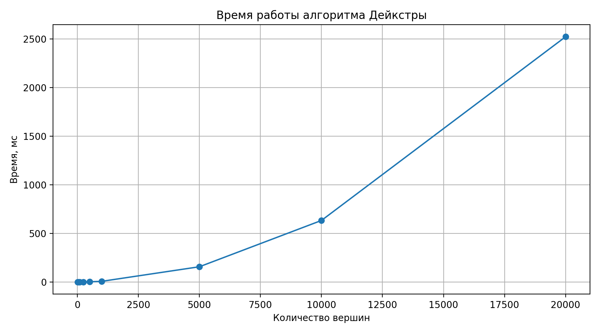

# Лабораторная работа №5

---

**ФИО:** Тимошенко Артём Романович

**Группа:** М8О-102БВ-25

---

## Постановка задачи

Реализовать представление графа и алгоритм на графе в соответствии с вариантами. Программа должна поддерживать работу через CLI, чтение графа из файла, выгрузку графа на диск и выгрузку результата работы алгоритма на диск.
Также должна быть поддержка тестов через GTest и бенчмарки

## Вариант задания

Представление графа:
**Список ребер**

Алгоритм:
**Кратчайший путь - алгоритм Дейкстры**

---

## Описание реализации

- **Граф**: ориентированный взвешенный граф, представленный списком ребер
- **Ребро**: хранит начальную и конечную вершины, вес
- **Вершины**: нумеруются от `1` до `N`
- **Веса**: только неотрицательные, так как алгоритм Дейкстры не работает с отрицательными весами
- **Результат алгоритма**: для каждой вершины выводится кратчайшее расстояние и путь от стартовой вершины
- **CLI**: поддерживает загрузку графа, добавление ребер, запуск Дейкстры, сохранение графа и результата

---

## Формат входного файла

```text
N M
from to weight
from to weight
...
```

где:
- `N` - количество вершин
- `M` - количество ребер
- `from` - начальная вершина ребра
- `to` - конечная вершина ребра
- `weight` - вес ребра

---

## Запуск

Для сборки используется `CMake`.

**Сборка основной программы:**
```bash
cmake --build cmake-build-debug --target lab5
```

**Запуск основной программы:**
```bash
./cmake-build-debug/lab5
```

**Сборка и запуск тестов:**
```bash
cmake --build cmake-build-debug --target lab5_tests
./cmake-build-debug/lab5_tests
```

**Сборка и запуск benchmark:**
```bash
cmake --build cmake-build-debug --target lab5_bench
./cmake-build-debug/lab5_bench
```

**Сохранение benchmark в JSON:**
```bash
./cmake-build-debug/lab5_bench --benchmark_out=benchmark.json --benchmark_out_format=json
```

**Построение графика benchmark:**
```bash
python3 plot_benchmark.py
```

НО предварительно необходимо скачать либу через `pip install matplotlib`

---

## Команды CLI

```text
0 - выйти
1 <filename> - загрузить граф из файла
2 <from> <to> <weight> - добавить ребро
3 <start> - запустить Дейкстру и вывести результат в консоль
4 <start> <filename> - запустить Дейкстру и записать результат в файл
5 <filename> - выгрузить текущий граф в файл
help - показать список команд
```

---

## Пример взаимодействия с CLI

```text
1 input.txt
Граф загружен

3 1
Стартовая вершина: 1

Вершина Расстояние      Путь
1       0               1
2       7               1 -> 3 -> 2
3       3               1 -> 3
4       9               1 -> 3 -> 2 -> 4
5       10              1 -> 3 -> 2 -> 4 -> 5

4 1 result.txt
Результат записан

5 output.txt
Граф выгружен

0
Bye Bye
```

## Бенчмарк

Benchmark выполнен с использованием Google Benchmark. Для тестов создавались графы, где количество ребер пропорционально количеству вершин: `E = 5V`.

Платформа:
- **CPU:** Apple M4 Pro, 14 cores
- **RAM:** 24 GB

Результаты:

| Вершины | Ребра | Время, мс |
|---:|---:|---:|
| 10 | 50 | 0.0008 |
| 50 | 250 | 0.0174 |
| 100 | 500 | 0.0676 |
| 250 | 1250 | 0.4097 |
| 500 | 2500 | 1.5777 |
| 1000 | 5000 | 6.2778 |
| 5000 | 25000 | 156.1073 |
| 10000 | 50000 | 632.6960 |
| 20000 | 100000 | 2523.7390 |

График зависимости времени работы от количества вершин:



---

## Использованные источники

- GTest: https://google.github.io/googletest/quickstart-cmake.html
- Google Benchmark: https://github.com/google/benchmark/blob/main/docs/user_guide.md

---

## Выводы

В ходе работы был изучен способ представления графа списком ребер и реализован алгоритм Дейкстры для поиска кратчайших путей от заданной стартовой вершины.
